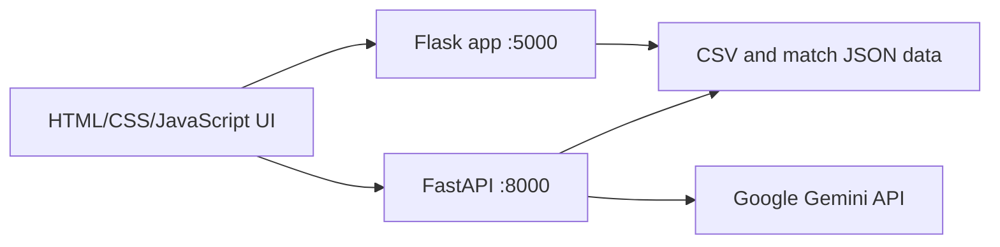

# U Cluj Tactical Hub

<p align="center">
  <strong>A football analytics and tactical decision-support platform for Universitatea Cluj.</strong><br />
  Player statistics, opponent analysis, AI-assisted tactical insights, and interactive match visualizations in one place.
</p>

<p align="center">
  
  
  
  
</p>

## Overview

**U Cluj Tactical Hub** is a football analytics project created for the U_HACK hackathon. It brings together player and match data to help explore performance, compare teams, identify turnover risks, and generate data-informed tactical suggestions for Universitatea Cluj.

The interface is organized around three modules:

- **Data Analytics** — browse teams and players, inspect player statistics, and view radar and GPS-based comparisons.
- **Tactical Strategy** — compare an opponent's duel statistics with league averages, receive a suggested playing style and best-fit lineup, and ask the AI Scouter questions about a player's available stats.
- **Turnover Risk** — explore team and player ball-loss indicators through a pitch heatmap, player rankings, and team comparisons.
- **2D Match Simulator** — visualize match events and tracking data in an interactive tactical view.

## Highlights

- Player and team data loaded from CSV, JSON, and Excel files.
- Player profile views with radar-chart statistics and GPS metrics.
- Opponent-based tactical suggestions, including an aggressive or possession-oriented approach.
- A ranked best-fit lineup generated from player performance metrics.
- Gemini-powered answers grounded in the selected player's available data.
- Turnover risk scores that give additional weight to losses in a team's own half and dangerous areas.
- Pitch heatmaps, risk rankings, and side-by-side team comparisons.
- Match-event and tracking-data visualization in the simulator.

## Technology Stack

| Area | Technologies |
| --- | --- |
| Frontend | HTML, CSS, JavaScript, Chart.js |
| Web application and turnover analysis | Flask, Flask-CORS |
| Player analytics and AI endpoints | FastAPI, Uvicorn, pandas |
| AI integration | Google Gemini API (`google-genai`) |
| Data formats | CSV, JSON, XLSX |

## Architecture

The project uses two Python services: Flask serves the hub and turnover-risk module, while FastAPI exposes player analytics, AI, tactical-strategy, and simulator-data endpoints.



## Project Structure

```text
U_HACK-main/
├── index.html                              # Main hub
├── frontend.html                           # Player analytics interface
├── main.py                                 # FastAPI analytics and AI endpoints
├── football_tactical_simulator_euro2024_final.html
├── static/                                 # Shared visual assets
├── date_jucatori_complet.csv               # Player and team statistics
├── 2025 - NOIEMBRIE .xlsx                  # GPS data
├── 2025 - DECEMBRIE .xlsx                  # GPS data
├── 3943043fisier1.json                     # Match event data
├── 3943043fisier2.json                     # Match tracking data
└── proiect/
    ├── backend.py                          # Flask app and turnover-risk API
    ├── turnover.html                       # Turnover-risk interface
    ├── date_jucatori_complet.csv
    └── Date - meciuri/                     # Per-match player statistics
```

## Getting Started

### Requirements

- Python 3.10 or newer
- A Google Gemini API key for AI-powered features

### 1. Clone the repository

```bash
git clone https://github.com/stefaniaelena20/U_HACK.git
cd U_HACK
```

### 2. Create a virtual environment and install dependencies

```bash
python -m venv .venv
```

Activate it:

```bash
# Windows PowerShell
.venv\Scripts\Activate.ps1

# macOS / Linux
source .venv/bin/activate
```

Install the packages used by the two services:

```bash
pip install fastapi "uvicorn[standard]" pandas openpyxl google-genai flask flask-cors
```

### 3. Configure local paths and the Gemini API key

Before starting the FastAPI service, update `BASE_PATH` in `main.py` so it points to the repository folder containing the CSV, Excel, JSON, and `static/` files. The current source contains a machine-specific Windows path.

The AI Scouter and tactical-summary features require a Gemini API key. Store the key in an environment variable and read it from the application code; do not commit API keys to GitHub.

```powershell
# Windows PowerShell — replace the value locally
$env:GOOGLE_API_KEY = "your-gemini-api-key"
```

```bash
# macOS / Linux — replace the value locally
export GOOGLE_API_KEY="your-gemini-api-key"
```

The current `main.py` initializes Gemini from a hard-coded key. Replace that configuration with an environment-variable lookup before running the project.

### 4. Start the FastAPI service

From the repository root, in the first terminal:

```bash
uvicorn main:app --reload --host 127.0.0.1 --port 8000
```

FastAPI's interactive API documentation is available at `http://127.0.0.1:8000/docs`.

### 5. Start the Flask application

In a second terminal, activate the same virtual environment and run:

```bash
cd proiect
python backend.py
```

Open the hub at `http://127.0.0.1:5000`. The analytics interface uses the FastAPI service on port `8000`; the turnover-risk module uses the Flask API on port `5000`.

## API Overview

### FastAPI — `http://127.0.0.1:8000`

| Method | Endpoint | Purpose |
| --- | --- | --- |
| `GET` | `/players` | Return the available player list |
| `GET` | `/player/{player_id}` | Return a player's statistics and GPS metrics |
| `GET` | `/player/{player_id}/chat?message=...` | Ask the AI Scouter about a selected player |
| `GET` | `/tactics/victory-strategy/{opp_id}` | Generate an opponent-based tactical suggestion and best-fit lineup |
| `GET` | `/tactics/simulation-data` | Return match-event and tracking data for the simulator |

### Flask — `http://127.0.0.1:5000`

| Method | Endpoint | Purpose |
| --- | --- | --- |
| `GET` | `/api/teams` | List teams available in the turnover dataset |
| `GET` | `/api/team/{team_name}/players` | Return a team's players and risk scores |
| `GET` | `/api/team/{team_name}/turnover_map` | Return turnover-risk zones for a team |
| `GET` | `/api/team/{team_name}/analysis` | Return turnover analysis and suggested players |
| `GET` | `/api/compare?team1=...&team2=...` | Compare average risk scores for two teams |

## How the Tactical Suggestion Works

1. The system compares the opponent's average duel-win percentage with the league average.
2. It selects a recommended style: **aggressive play** when the opponent's duel rate is below the league average, or **possession** otherwise.
3. It scores Universitatea Cluj players using relevant performance and GPS indicators, then returns the top 11 candidates.
4. Gemini turns the calculated result into a short tactical explanation.

## Data Notes

- The project expects the player CSV, GPS workbooks, match JSON files, and static assets to remain available at the paths configured by the application.
- The turnover-risk service reads match files from `proiect/Date - meciuri/` and the player CSV from the `proiect/` directory.
- If a page or chart loads without data, first check that both services are running and that their configured data paths match the repository layout.

## Team

Created for **U_HACK** by **Team Mărăști**. The project was developed collaboratively, with **Cristina Fătan** serving as team captain.

## License

No license is currently specified. Contact the project team before reusing or redistributing the code or included datasets.
